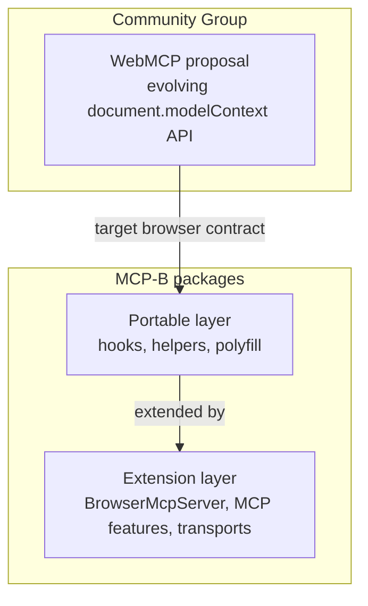
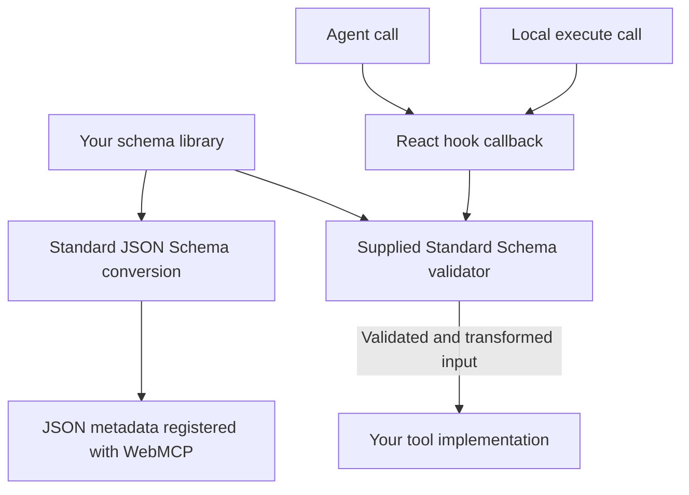

The WebMCP proposal and MCP-B packages evolve on separate schedules. The
[Community Group draft](https://webmachinelearning.github.io/webmcp/) owns the
proposed browser API. MCP-B package references own the behavior shipped by this
project.

The phrase **strict core** describes MCP-B's portable package boundary. It is
not a second definition of the WebMCP proposal. Keeping that boundary narrow
lets libraries publish tools through native implementations or the polyfill
without depending on an MCP server or transport.

## Three related layers

The live draft owns the exact `ModelContext` members and signatures. MCP-B may
retain compatibility types or adapters while browser implementations converge.
Do not infer proposal status from where a method appears in an MCP-B type.

## Why the extension boundary exists

`BrowserMcpServer` adds `listTools()`, prompt and resource registration, and a
composed official MCP server. Transports, iframe routing, and the local relay
connect that server to explicit MCP clients. These capabilities solve MCP-B
integration problems; they are not browser API methods.

Protocol-specific features remain available through
`BrowserMcpServer.mcpServer`. Keeping them behind the composed server prevents
the browser surface from becoming a second copy of the MCP SDK.

Sites that only publish browser tools can use the portable layer. Applications
that need prompts, resources, bridges, or desktop MCP clients use the extension
layer. See [Runtime layering](/explanation/architecture/runtime-layering) for
the composition model and [Choose a runtime](/how-to/choose-runtime) for
package selection.

## Why Standard Schema support lives in the adapters

A tool needs both a description of its input and a way to check actual arguments. These are separate
jobs. [Standard JSON Schema](https://standardschema.dev/json-schema) lets a schema library produce
JSON Schema metadata. [Standard Schema](https://standardschema.dev/) lets an integration call that
library's validator. The library remains responsible for its refinements, defaults, transforms, and
async checks.

The shared [`usewebmcp` hook](/packages/usewebmcp/reference) owns the React callback, so it can run the
supplied validator before either a local call or an agent call. This keeps validation consistent
whether `document.modelContext` comes from the browser, the polyfill, or the MCP-B runtime. It adds
no dependency on a validation engine. [`@mcp-b/react-webmcp`](/packages/react-webmcp/reference) uses
the same callback and adds MCP result formatting and output metadata.

The standalone polyfill keeps its browser contract focused on JSON Schema metadata. Adding an
optional helper under [`@mcp-b/webmcp-polyfill/schema`](/packages/webmcp-polyfill/reference#schema-entry)
does not change `document.modelContext.registerTool()` or make it call a validator. This is an
adapter extension, not a browser API feature. Declarative forms separately use the browser's form
constraint validation.

The MCP route has another validation owner: the official server composed by
[`BrowserMcpServer`](/packages/webmcp-ts-sdk/reference#schema-boundary). It can use a validator
preserved by the schema adapter, but direct browser calls bypass that MCP server. React hooks
therefore forward plain JSON metadata and keep vendor validation in their callback. Applying a
string-to-number transform in both places would feed the first transform's number back into a
validator expecting a string.

The [schema guide](/how-to/use-schemas-and-structured-output) shows how to keep one owner for vendor
validation when registering directly, and how to add MCP output schemas independently. Upstream
[`webmcp-types`](https://github.com/webmachinelearning/webmcp-types) owns the core browser declarations;
[`@mcp-b/webmcp-types`](/packages/webmcp-types/reference) derives compatibility and MCP extension types.
Neither type package performs runtime validation.
