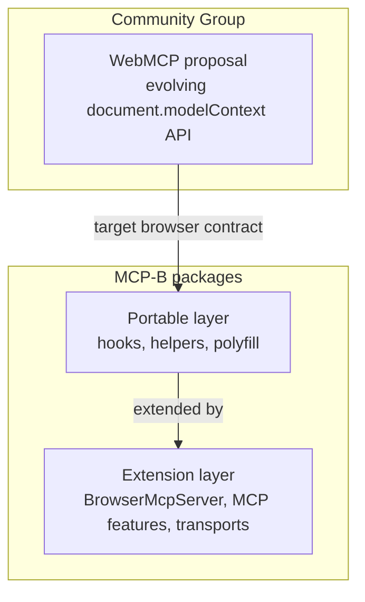
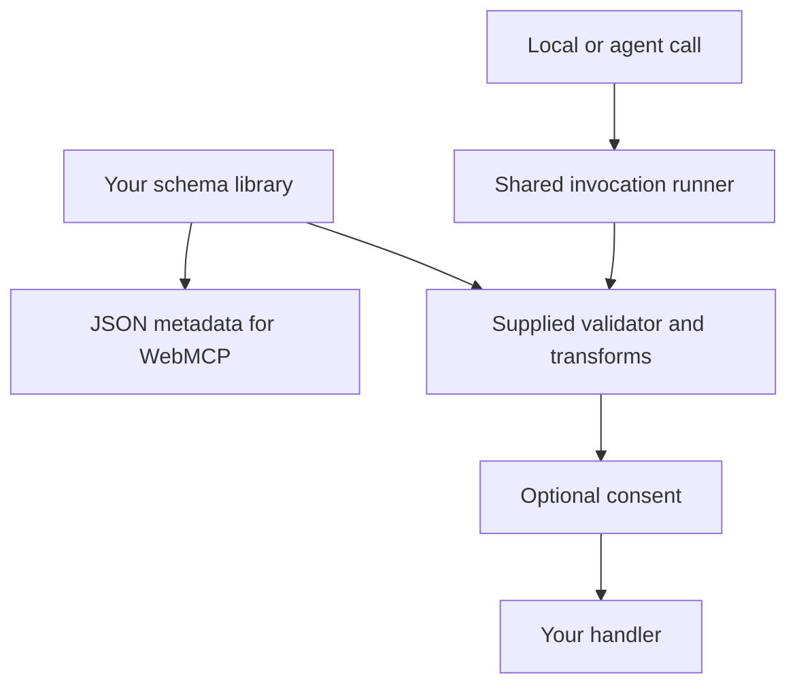

The WebMCP proposal and MCP-B packages evolve on separate schedules. The
[Community Group draft](https://webmachinelearning.github.io/webmcp/) owns the
proposed browser API. MCP-B package references own the behavior shipped by this
project.

The phrase **strict core** describes MCP-B's portable package boundary. It is
not a second definition of the WebMCP proposal. Keeping that boundary narrow
lets libraries publish tools through native implementations or the polyfill
without depending on an MCP server or transport.

## Three related layers

The live draft owns the exact `ModelContext` members and signatures. MCP-B may
retain compatibility types or adapters while browser implementations converge.
Do not infer proposal status from where a method appears in an MCP-B type.

## Why the extension boundary exists

`BrowserMcpServer` adds `listTools()`, prompt and resource registration, and a
composed official MCP server. Transports, iframe routing, and the local relay
connect that server to explicit MCP clients. These capabilities solve MCP-B
integration problems; they are not browser API methods.

Protocol-specific features remain available through
`BrowserMcpServer.mcpServer`. Keeping them behind the composed server prevents
the browser surface from becoming a second copy of the MCP SDK.

Sites that only publish browser tools can use the portable layer. Applications
that need prompts, resources, bridges, or desktop MCP clients use the extension
layer. See [Runtime layering](/explanation/architecture/runtime-layering) for
the composition model and [Choose a runtime](/how-to/choose-runtime) for
package selection.

## Why Standard Schema support lives in the adapters

A tool needs both a description of its input and a way to check actual arguments. These are separate
jobs. [Standard JSON Schema](https://standardschema.dev/json-schema) lets a schema library produce
JSON Schema metadata. [Standard Schema](https://standardschema.dev/) lets an integration call that
library's validator. The library remains responsible for its refinements, defaults, transforms, and
async checks.

[`@mcp-b/webmcp-plugins`](https://github.com/WebMCP-org/npm-packages/tree/main/packages/webmcp-plugins)
owns the shared invocation runner and Standard Schema adapter. Native WebMCP, polyfilled tools,
and the MCP bridge can use the same managed callback. The [`usewebmcp` hook](/packages/usewebmcp/reference)
adds React registration lifetime and chooses that adapter from `inputSchema`.
[`@mcp-b/react-webmcp`](/packages/react-webmcp/reference) adds MCP result formatting.

The runner keeps validation ahead of consent, regardless of plugin array order. Named plugins
wrap the call for state, tracing, or approval. Execution state is an optional store; React subscribes
only where a component needs its snapshot. This separates registration from call-driven UI updates.

The standalone polyfill owns browser behavior, including declarative form constraints. It does not
install invocation plugins or call Standard Schema validators. Its `/schema` helper handles metadata
and compatibility. Moving reusable invocation behavior into a separate package also keeps it useful
when native browser support makes the fallback unnecessary.

The official MCP server adds protocol input/output validation. For managed callbacks, the bridge
places those checks inside the shared invocation and avoids applying a vendor transform twice.
Unwrapped direct browser calls bypass MCP server validation.

The [schema guide](/how-to/use-schemas-and-structured-output) shows direct and React registration.
Upstream [`webmcp-types`](https://github.com/webmachinelearning/webmcp-types) owns browser declarations;
[`@mcp-b/webmcp-types`](/packages/webmcp-types/reference) derives MCP extension and compatibility types.
Neither type package performs runtime validation.
