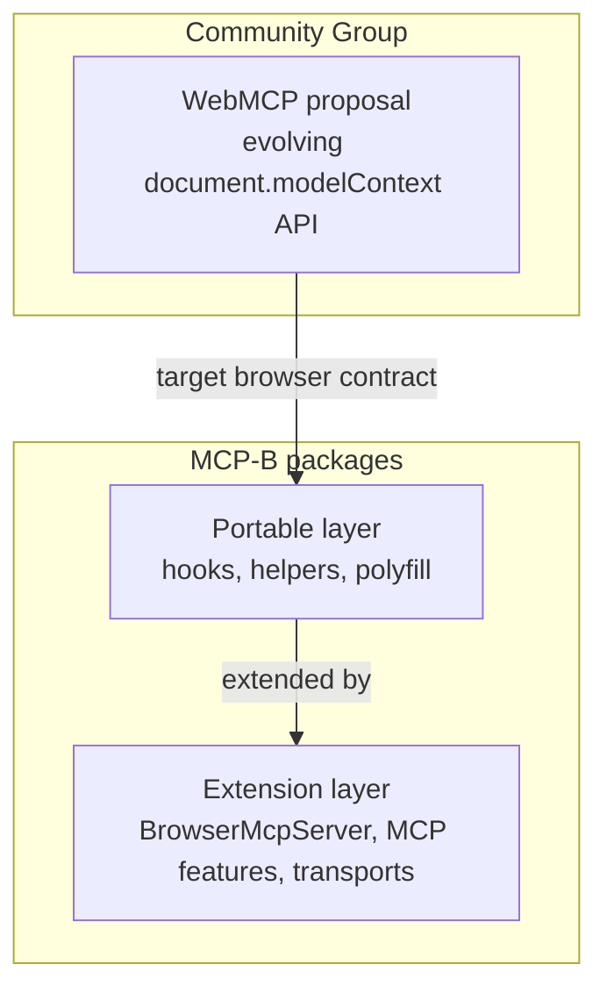
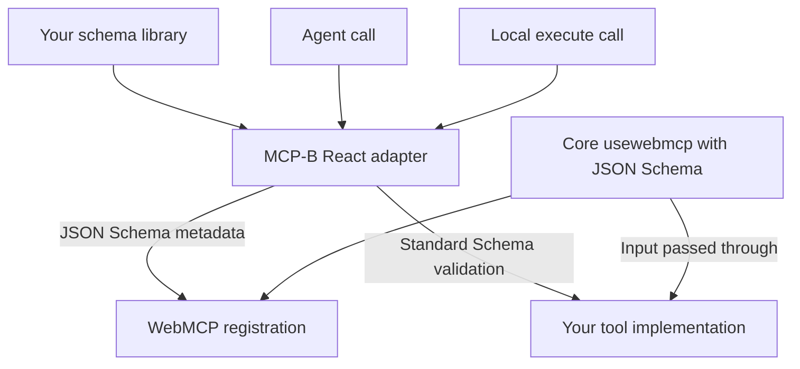

The WebMCP proposal and MCP-B packages evolve on separate schedules. The
[Community Group draft](https://webmachinelearning.github.io/webmcp/) owns the
proposed browser API. MCP-B package references own the behavior shipped by this
project.

The phrase **strict core** describes MCP-B's portable package boundary. It is
not a second definition of the WebMCP proposal. Keeping that boundary narrow
lets libraries publish tools through native implementations or the polyfill
without depending on an MCP server or transport.

## Three related layers

```mermaid
flowchart TB
  subgraph Upstream["Community Group"]
    Proposal["WebMCP proposal<br/>evolving document.modelContext API"]
  end

  subgraph Project["MCP-B packages"]
    Portable["Portable layer<br/>hooks, helpers, polyfill"]
    Extensions["Extension layer<br/>BrowserMcpServer, MCP features, transports"]
    Portable -->|"extended by"| Extensions
  end

  Proposal -->|"target browser contract"| Portable
```

The live draft owns the exact `ModelContext` members and signatures. Upstream [`webmcp-types`](https://github.com/webmachinelearning/webmcp-types)
provides the browser declarations. MCP-B adapter and extension contracts live
with [`@mcp-b/webmcp-ts-sdk`](/packages/webmcp-ts-sdk/reference). The SDK may
include compatibility adapters, but they do not redefine the proposal.

## Why the extension boundary exists

`BrowserMcpServer` adds `listTools()`, prompt and resource registration, and a
composed official MCP server. Transports, iframe routing, and the local relay
connect that server to explicit MCP clients. These capabilities solve MCP-B
integration problems; they are not browser API methods.

Protocol-specific features remain available through
`BrowserMcpServer.mcpServer`. Keeping them behind the composed server prevents
the browser surface from becoming a second copy of the MCP SDK.

Sites that only publish browser tools can use the portable layer. Applications
that need prompts, resources, bridges, or desktop MCP clients use the extension
layer. See [Runtime layering](/explanation/architecture/runtime-layering) for
the composition model and [Choose a runtime](/how-to/choose-runtime) for
package selection.

## Why Standard Schema support lives in the adapters

A tool needs both a description of its input and a way to check actual arguments. These are separate
jobs. [Standard JSON Schema](https://standardschema.dev/json-schema) lets a schema library produce
JSON Schema metadata. [Standard Schema](https://standardschema.dev/) lets an integration call that
library's validator. The library remains responsible for its refinements, defaults, transforms, and
async checks.

The core [`usewebmcp` hook](/packages/usewebmcp/reference) accepts upstream JSON Schema metadata and
does not validate runtime input. It reports a Standard Schema object, such as a Zod schema, as a
registration error. [`@mcp-b/react-webmcp`](/packages/react-webmcp/reference) converts
Standard JSON Schema metadata and calls the supplied validator before either local or agent calls.
It adds MCP result formatting and output metadata as well.

```mermaid
flowchart TD
  Schema["Your schema library"] --> Adapter["MCP-B React adapter"]
  Adapter -->|"JSON Schema metadata"| Browser["WebMCP registration"]
  Agent["Agent call"] --> Adapter
  Local["Local execute call"] --> Adapter
  Adapter -->|"Standard Schema validation"| Handler["Your tool implementation"]
  Core["Core usewebmcp with JSON Schema"] --> Browser
  Core -->|"Input passed through"| Handler
```

The standalone polyfill keeps its browser contract focused on JSON Schema metadata.
[`@mcp-b/webmcp-ts-sdk/schema`](/packages/webmcp-ts-sdk/reference#schema-boundary) converts schemas
for direct WebMCP registrations and the MCP adapter; it does not change
`document.modelContext.registerTool()` or make it call a validator. Declarative tools separately use
the browser's form constraint validation.

The MCP route has another validation owner: the official server composed by
[`BrowserMcpServer`](/packages/webmcp-ts-sdk/reference#schema-boundary). It can use a validator
preserved by the schema adapter, but direct browser calls bypass that MCP server. React hooks
therefore forward plain JSON metadata and keep vendor validation in their callback. Applying a
string-to-number transform in both places would feed the first transform's number back into a
validator expecting a string.

The [schema guide](/how-to/use-schemas-and-structured-output) shows how to keep one owner for vendor
validation when registering directly, and how to add MCP output schemas independently. Upstream
[`webmcp-types`](https://github.com/webmachinelearning/webmcp-types) owns the core browser declarations.
The SDK schema adapter handles MCP-B conversion; neither package performs runtime validation by itself.
