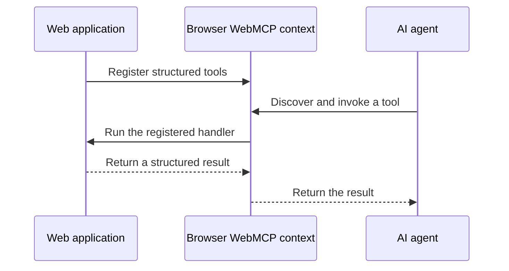

WebMCP is a Community Group proposal that lets a web application publish
structured actions as tools for AI agents. The site defines the actions and
their inputs. The agent uses that contract instead of inferring behavior from
screenshots, DOM structure, or click sequences.

The browser is a useful home for these tools because the page already has the
application's state, authorization checks, and visible interface. A tool can
reuse that context without moving browser-only logic into a separate service.
The application still validates inputs, enforces permissions, and asks for
confirmation when the consequence warrants it.

## Learn about the proposal

The [Community Group draft](https://webmachinelearning.github.io/webmcp/) owns
the proposed JavaScript API. Chrome maintains the current [developer
overview](https://developer.chrome.com/docs/ai/webmcp), [user journey
guide](https://developer.chrome.com/docs/ai/webmcp/use-cases), and [WebMCP and
MCP comparison](https://developer.chrome.com/docs/ai/webmcp/compare-mcp).

The [WebMCP API sources](/reference/webmcp/standard-api) and
[declarative API sources](/reference/webmcp/declarative-api) route
implementation questions to their upstream owners. [WebMCP spec status and
limitations](/explanation/design/spec-status-and-limitations) collects W3C
draft status, security, inspection, and testing resources.

## WebMCP vs MCP

The [Model Context Protocol](https://modelcontextprotocol.io/) (MCP) connects AI
applications to external tools, data sources, and workflows through local or
remote MCP servers. WebMCP solves a narrower browser problem: it lets the
currently loaded page describe actions that an agent can discover and invoke.

The two approaches complement each other. A bridge can publish WebMCP page
tools to an MCP client while keeping execution, authorization checks, and user
review in the browser. Chrome's [WebMCP and MCP
comparison](https://developer.chrome.com/docs/ai/webmcp/compare-mcp) is the
upstream reference for the distinction.

## Where MCP-B fits

MCP-B provides packages around the proposal, including a polyfill, React
bindings, transports, iframe bridges, and a local relay. Bridges can make page
tools available to MCP clients, but the browser document remains the execution
environment. MCP-B does not define the WebMCP proposal.

[WebMCP and MCP-B
extensions](/explanation/strict-core-vs-mcp-b-extensions) explains which
behavior belongs to this project. [Transports and
bridges](/explanation/architecture/transports-and-bridges) explains how those
packages cross browser boundaries.
